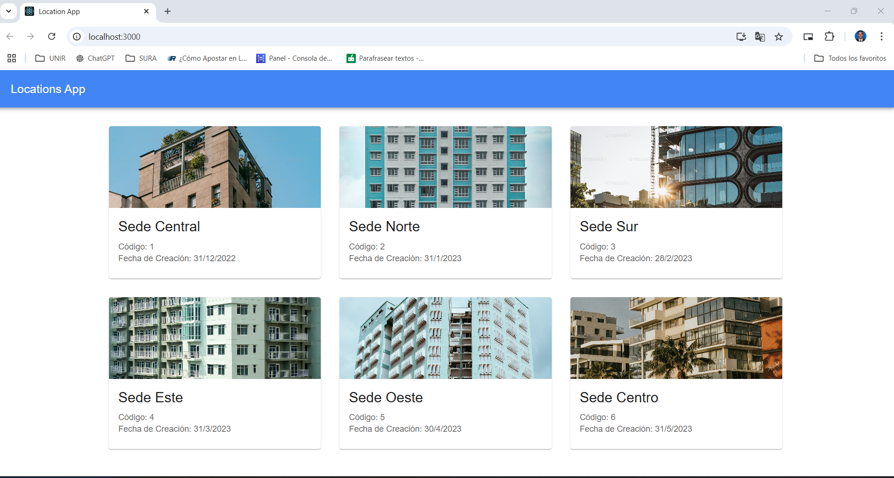

# Backend API - Laravel

This project is the backend implementation of a technical test for a Full Stack Developer role. The backend is built with **Laravel** and provides a RESTful API with authentication using an API Key. It serves a list of locations as requested by the frontend.

---

## Features

- Implements a RESTful API endpoint to fetch a list of locations.
- Secure API Key authentication for all API requests.
- Returns location details including:
  - Code (ID)
  - Name
  - Image URL
  - Creation Date
- Includes clear error handling and validation for invalid or missing API Keys.
- Follows Laravel best practices for routing, controllers, and resource management.
- Optional integration with static analysis tools like **PHPStan** or **Psalm**.

---

## Requirements

- PHP 8.1 or higher
- Composer
- Laravel Framework
- A web server (e.g., Apache, Nginx, or Laravel's built-in server)

---

## Installation and Setup

1. Clone the repository:
2.php artisan serve

# location-api
